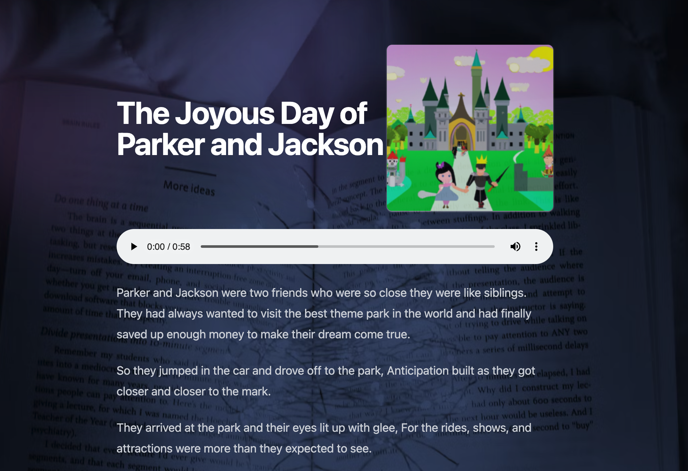
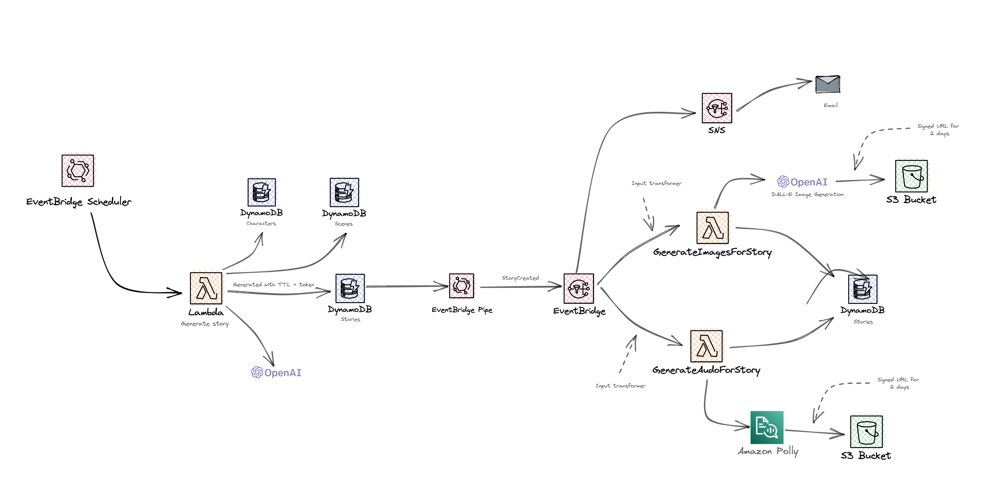

<h1>📖 AI Generated Stories</h1>

Example open source event-driven application that generates a new bed time story for your children every night using Lambda, EventBridge, DynamoDB, App Runner, ChatGPT and DALL-E.

<a href="https://aws-blogs-prod.amazon.com/compute/implementing-an-event-driven-serverless-story-generation-application-with-chatgpt-and-dall-e/">Read the blog post &rarr;</a>

  <h3>Features: New story every day, Audio using Amazon Polly, story using ChatGPT and images by DALL-E, all generated from an event-driven architecture.</h3>

# Core Features

- ⏱️ [EventBridge Scheduler](https://aws.amazon.com/blogs/compute/introducing-amazon-eventbridge-scheduler/) to generate new story every bedtime
- 📦 Event architecture using [Amazon EventBridge](https://aws.amazon.com/eventbridge/) to fan out processing of images, audio and emails.
- 🤖 New unqiue story every night using [ChatGPT and DALL-E](https://openai.com/blog/chatgpt) for images
- 🧑‍💻 Deploy with [AWS CDK](https://aws.amazon.com/cdk/)

# How it works

1. Every day at a configured time an [EventBridge Schedule](https://aws.amazon.com/blogs/compute/introducing-amazon-eventbridge-scheduler/) is trigger which triggers a Lambda function.

2.	The `create-story` lambda function takes characters and scenes from the [Amazon DynamoDB](https://aws.amazon.com/dynamodb/) tables and uses [ChatGPT](https://openai.com/blog/chatgpt) (OpenAI API) to create the story. The story is stored with a 2 day TTL in DynamoDB.

3.	An [Amazon EventBridge Pipe](https://docs.aws.amazon.com/eventbridge/latest/userguide/eb-pipes.html) is configured to [listen to all New items created inside the table using streams](https://docs.aws.amazon.com/amazondynamodb/latest/developerguide/Streams.html#:~:text=A%20DynamoDB%20stream%20is%20an,data%20items%20in%20the%20table.) and triggers an [Amazon EventBridge event](https://aws.amazon.com/eventbridge/) (StoryCreated).

4.	EventBridge routes the `StoryCreated` event to three targets: 
  - SNS for email
      - SNS for email: SNS is used in this example to notify the user that a new story has been created.
  - [AWS Lambda](https://aws.amazon.com/lambda/) function for Audio generation 
    - Lambda for Audio: Amazon Polly is created to create audio for the story that has been generated. The audio file is stores into S3 with a signed URL (for 2 days).
  - [AWS Lambda](https://aws.amazon.com/lambda/) function for image generation.
    - Lambda for image generation: This function takes the story and scene and creates an image for the story using DALL-E (OpenAI API). This image is stored inside S3 with a signed URL (2 days).

5.	The frontend application is running on [AWS App Runner](https://aws.amazon.com/apprunner/) and is hosting a NextJS SRR application. When the user goes to the URL in the Email (through SNS topic), the story is loaded and displayed.

# Design choices

This application was designed as a proof of concept, and if you want to take extract patterns there might be some design considerations to understand before you do.

This application is designed for single use, every day it will email a single person a URL to a new story, if you wanted to scale this out to many users you would have to change the architecture to support that.

## Hosting the frontend application
The frontend application is built with NextJS and hosted in App Runner, the App Runner container has the permission to talk to the DynamoDB table to get stories. The stories have a TTL of 2 days and will not be available after that duration (removed from the table). 

## EventBridge Pub/Sub
Once the story is created, EventBridge will raise an event to many consumers (audio processing, image creation, and SNS), this can lead to race conditions. There could be a chance that the audio or image is not ready when the user views the story on the screen. The application will check for audio and images, and fallback to render just the story if this information is not available yet (due to async processing). For a simple use case this might be fine but if you need to wait you may want to look at patterns like the aggregator or step function workflows that may help with this processing of state.

## Three DynamoDB tables vs one
The application is fairly simple, and three tables seemed to be a pattern that worked well here. The characters and scenes table is not updated very often and the stories hold the generated stories. If you wanted to support many users you will need to consider your access patterns and table design.

# Deploying

## Prerequisites

-  [OpenAI API Key](https://platform.openai.com/overview)
- Node v16 or greater
- [AWS CDK](https://aws.amazon.com/cdk/)

## Create your OpenAI API Key and add to Secret Manager.

First you will need an OpenAI API key, if you don’t have an account you will need to set one. You can go here to get started: https://platform.openai.com/overview

Once you have your key, you will need to add it to Secret Manager the secret name needs to be `open-api-key`.

## Deploy into your AWS account

1.	Clone the repository

2.	Change the config.json file (add your email address and cron job)

3.	Run `npm run install:all`

4.	Run `npm run deploy`
    - This will deploy three stacks (Tables, Frontend, Backend) into your AWS account using CDK.
    - This can take a few minutes to deploy (containers need to start)

5. Populate your DynamoDB databases (Scenes and Characters)
    - You can find the files in `/backend/data/`, change these to what you want.
    - Run `npm run populate-db` to populate these tables.
    

5.	Once done, your application is ready.

# Generating a story

EventBridge scheduler will trigger your Lambda function to generate a story at the configured time set in your config.json file (default 7:15pm).

You can also manually trigger the function (<stage>-aiStoriesBackend-scheduledlambdafunction<id>)

## Security

See [CONTRIBUTING](CONTRIBUTING.md#security-issue-notifications) for more information.

## License

This library is licensed under the MIT-0 License. See the LICENSE file.
